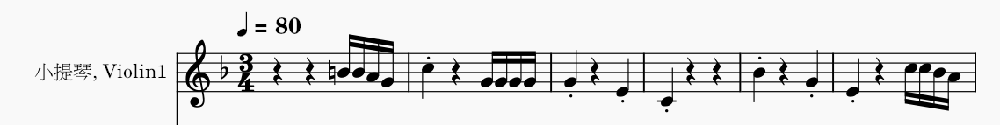

# 運作原理

## 拍子記號 

目前支援 2/4，3/4，4/4 拍

1. 下面個數等於一拍既數值，例如：3**4**即係一拍等於一個四分音符。
2. 上面個數等於一個小節有幾多拍，例如：**3**4即係一個小節有3拍。

## 位置

假設一個小節既拍子記號係44，即係一個小節有四拍。我地設立一個小節有48個位置，即係一拍需要12個位置。

1. 一個四分音符需要12個位置。
2. 一個八分音符需要6個位置。
3. 一個十六分音符需要3個位置。

點解會係48個位置？因為我地計好曬數，48個位置可以支援到常見既十六分音符，以及三連音。

如果要套用位置既概念去第二個拍子記號，
> 例如 34:

1. 我地依然套用一拍需要12個位置。
2. 咁一個小節就需要36個位置。
3. 一個四分音符或八分音符依然需要12個或者6個位置。

## Ticks per beat
明白左拍子記號同位置之後，我地要再介紹多一個概念：Ticks per beat (TPB)。假設一名鼓手一直以均衡既節奏打鼓，咁打左幾多下就係一拍？如果係 480 TPB，答案就係每打鼓480下就等於打左一拍。

> 例如：拍子記號＝44，TPB＝480

1. 480 ticks 等於一拍
2. 咁一個小節4拍就係 480*4＝1920 ticks。
所以每當電腦睇到1920 ticks，就知道過左一個小節。

> 例子2: 拍子記號＝44，TPB＝480

1. 一個四分音符係一拍，即係一個四分音符佔有 480 ticks。
2. 一個八分音符係半拍，即係一個八分音符佔有 240 ticks。
3. 一個小節有48個位置，即係一個位置佔有 480*4/48＝40 ticks。

## 總結
當明白以上概念，就可以繼續處理更複習既音符同拍子記號。未來方向可以增加位置以支援更短既音符，例如三十二分音符。

## 短期目標
修改目前program以支援其他拍子記號，例如： 28，38，68